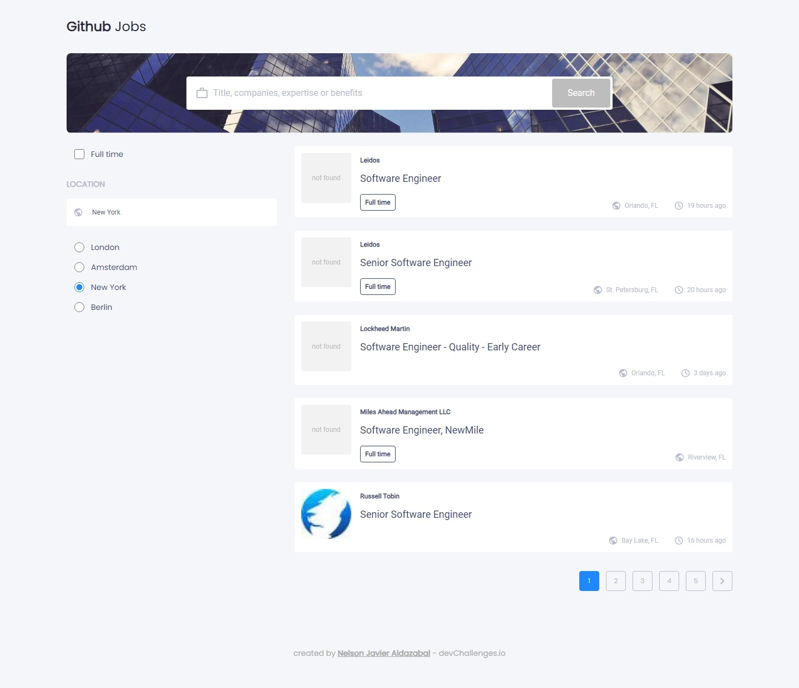

<!-- Please update value in the {}  -->

<h1 align="center">Github Jobs</h1>

<div align="center">
   Solution for a challenge from  <a href="http://devchallenges.io" target="_blank">Devchallenges.io</a>.
</div>

<div align="center">
  <h3>
    <a href="https://githubjobs.vercel.app">
      Demo
    </a>
    <span> | </span>
    <a href="https://github.com/NJ9802/devChallenges">
      Solution
    </a>
    <span> | </span>
    <a href="https://devchallenges.io/challenges/TtUjDt19eIHxNQ4n5jps">
      Challenge
    </a>
  </h3>
</div>

<!-- TABLE OF CONTENTS -->

## Table of Contents

- [Overview](#overview)
  - [Built With](#built-with)
- [Features](#features)
- [How to use](#how-to-use)
- [Contact](#contact)
- [Acknowledgements](#acknowledgements)

<!-- OVERVIEW -->

## Overview



Hi everyone! I would like to share my solution to the Github Jobs challenge. You can check out the live demo at this [Link](https://devchcountryquiz.surge.sh/). In this project I learned how to work with React Query from Tanstack. I also learned how to pass information through UrlSearchParams Web API and how to work with the new Route Handlers from NextJS App Router. I had to think of a way to work with an API provider that offers very few requests for the free plan. All of these challenges made me grow as a Web Developer and improve my development skills.

### Built With

<!-- This section should list any major frameworks that you built your project using. Here are a few examples.-->

- [React](https://react.dev/)
- [Next.js](https://nextjs.org/)
- [Tailwind CSS](https://tailwindcss.com/)
- [TypeScript](https://www.typescriptlang.org/)

## Features

<!-- List the features of your application or follow the template. Don't share the figma file here :) -->

This application/site was created as a submission to a [DevChallenges](https://devchallenges.io/challenges) challenge. The [challenge](https://devchallenges.io/challenges/TtUjDt19eIHxNQ4n5jps) was to build an application to complete the given user stories.

## How To Use

<!-- Example: -->

To clone and run this application, you'll need [Git](https://git-scm.com) and [Node.js](https://nodejs.org/en/download/) (which comes with [npm](http://npmjs.com)) installed on your computer. From your command line:

```bash
# Clone this repository
$ git clone https://github.com/NJ9802/devChallenges

# Go to challenge directory
$ cd {challenge-directory}

# Install dependencies
$ npm install

# Run the app
$ npm start
```

## Acknowledgements

<!-- This section should list any articles or add-ons/plugins that helps you to complete the project. This is optional but it will help you in the future. For example: -->

- [Steps to replicate a design with only HTML and CSS](https://devchallenges-blogs.web.app/how-to-replicate-design/)
- [Node.js](https://nodejs.org/)
- [Marked - a markdown parser](https://github.com/chjj/marked)

## Contact

- Website [nelsonjavier.vercel.app](https://nelsonjavier.vercel.app)
- GitHub [@NJ9802](https://github.com/NJ9802)
- Twitter [@NJ9802](https://twitter.com/NJ9802)
